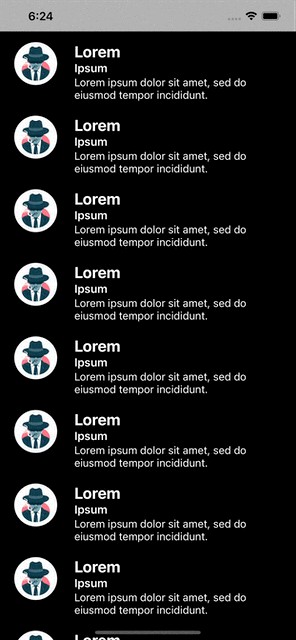

<a href="https://www.simform.com/"></a>
# SSMultiSwipeCellKit
## Multi Cell selection for UITableView with sliding animation
[![Swift Version][swift-image]][swift-url]
[![Build Status][travis-image]][travis-url]
[![Carthage compatible][carthage-icon]][carthage-link]
[![SPM compatible][spm-icon]][spm-link]
[![License][license-image]][license-url]
[![PRs Welcome][PR-image]][PR-url]
[![Platform][platform-image]][platform-url]
<!--[![CocoaPods][cocoapods-version][cocoapods-version-link]-->

SSMultiSwipeCellKit provides feature for UITableView to select multiple cell at once with beautiful sliding animations.

# Features

- Up to 3 leading and 3 trailing actions
- Set image and/or text for the action indicator for swipe
- Easy to use and lightweight

# 🎬 Preview

| Leading actions | Trailing actions |
|--|--|
|  |  |


# Installation

### CocoaPods

[CocoaPods][cocoapods-link] is a dependency manager for Cocoa projects. You can install it with the following command:

```bash
$ gem install cocoapods
```

To integrate SSMultiSwipeCellKit into your Xcode project using CocoaPods, specify it in your `Podfile`:

```ruby
source 'https://github.com/CocoaPods/Specs.git'
platform :ios, '15.0'
use_frameworks!

target '<Your Target Name>' do
    pod 'SSMultiSwipeCellKit'
end
```

Then, run the following command:

```bash
$ pod install
```

### Carthage

[Carthage][carthage-link] is a decentralized dependency manager that builds your dependencies and provides you with binary frameworks. To integrate SSMultiSwipeCellKit into your Xcode project using Carthage, specify it in your `Cartfile`:

```ogdl
github "SimformSolutionsPvtLtd/SSMultiSwipeCellKit" ~> 1.0.0
```
Run `carthage update --use-xcframeworks` to build the framework and drage the built SSMultiSwipeCellKit.framework into your Xcode project.

### Swift Package Manager

The [Swift Package Manager][spm-link] is a tool for automating the distribution of Swift code and is integrated into the `swift` compiler. 

Once you have your Swift package set up, adding SSMultiSwipeCellKit as a dependency is as easy as adding it to the `dependencies` value of your `Package.swift`.

```swift
dependencies: [
    .package(url: "https://github.com/SimformSolutionsPvtLtd/SSMultiSwipeCellKit.git", .upToNextMajor(from: "1.0.0"))
]
```


# How it works:

1. Assign our custom class SSTableView to you UITableView

| Screenshot |
|--|
|  |

2. Confirm the SSTableCellDelegate methods
```swift
extension ViewController: SSTableCellDelegate {
    
    func leadingSwipeActions(_ tableView: UITableView, leadingSwipeActionsConfigurationForRowAt indexPath: IndexPath) -> SSSwipeConfiguration? {
        let a1 = SSSwipeAction(image: nil, text: "Queue", completion: { indexPaths in
            // use selected indexPaths for leading action 1
        })
        let a2 = SSSwipeAction(image: UIImage(named: "archive"), text: nil, completion: { indexPaths in
           // use selected indexPaths for leading action 2
        })
        let a3 = SSSwipeAction(image: UIImage(named: "select"), text: "select", completion: { indexPaths in
           // use selected indexPaths for leading action 3
        })
        a1.backgroundColor = .cyan
        a2.backgroundColor = .darkGray
        a3.backgroundColor = .green
        
        return SSSwipeConfiguration(actions: [a3, a2, a1])
    }
    
    func trailingSwipeActions(_ tableView: UITableView, trailingSwipeActionsConfigurationForRowAt indexPath: IndexPath) -> SSSwipeConfiguration? {
        
        let a4 = SSSwipeAction(image: UIImage(named: "trash"), text: "remove", completion: { indexPaths in
           // use selected indexPaths for trailing action 1
        })
        let a5 = SSSwipeAction(image: UIImage(named: "tick"), text: nil, completion: { indexPaths in
           // use selected indexPaths for trailing action 2
        })
        let a6 = SSSwipeAction(image: nil, text: "snooze", completion: { indexPaths in
           // use selected indexPaths for trailing action 3
        })
        a4.backgroundColor = .red
        a5.backgroundColor = .brown
        a6.backgroundColor = .systemIndigo
        
        return SSSwipeConfiguration(actions: [a6, a5, a4])
    }
    
}
```

3. Create a customr table cell and set the cell delegate as self when returning `cellForRowAt` and you are good to go 👍
```swift
class TableCell: SSTableCell {}
```

```swift
func tableView(_ tableView: UITableView, cellForRowAt indexPath: IndexPath) -> UITableViewCell {
    guard let cell = table.dequeueReusableCell(withIdentifier: AppIdentifiers.tableCell.identifier, for: indexPath) as? TableCell else {
        return UITableViewCell()
    }
    cell.configureCell(data: tableItems[indexPath.row])
    cell.delegate = self
    return cell
}
```

# How to customize swipe action threshold values :

* Take an Outlet of the SStableView and assign percentage values fot threshold
```swift
    tableView.secondSwipeThreshold = 30
    tableView.thirdSwipeThreshold = 60
```

# How to customize leading and trailing action views:

* Change backgound color
```swift
    let action = SSSwipeAction(image: UIImage(named: "trash"), text: "remove", completion: { indexPaths in
       // use selected indexPaths for trailing action 1
    })
    action.backgroundColor = .red    
```
* Change actionIndicator view size
```swift
    guard let cell = table.dequeueReusableCell(withIdentifier: AppIdentifiers.tableCell.identifier, for: indexPath) as? TableCell else {
        return nil
    }
    let action = SSSwipeAction(image: UIImage(named: "trash"), text: "remove", completion: { indexPaths in
       // use selected indexPaths for trailing action 1
    })
    action.actionIndicatorViewSize = cell.frame.height / 2
```

* Change action indicator icon offset
```swift
    let action = SSSwipeAction(image: UIImage(named: "trash"), text: "remove", completion: { indexPaths in
       // use selected indexPaths for trailing action 1
    })
    action.actionIndicatorIconOffset = 10
```

## Find this library useful? ❤️
Support it by joining __[stargazers]__ for this repository.⭐

## 🤝 How to Contribute

Whether you're helping us fix bugs, improve the docs, or a feature request, we'd love to have you! 💪
Check out our __[Contributing Guide]__ for ideas on contributing.

# Check our other Libraries:
* Check our other Libraries also - [SimformSolutionsPvtLtd][SimformSolutionsPvtLtd]

## Bugs and Feedback

For bugs, feature requests, and discussion please use __[GitHub Issues]__.

## License

Distributed under the MIT license. See [LICENSE][license-url] for more information.

[//]: # (These are reference links used in the body of this note and get stripped out when the markdown processor does its job. Thanks SO - http://stackoverflow.com/questions/4823468/store-comments-in-markdown-syntax)

   [git-repo-url]:                              <https://github.com/SimformSolutionsPvtLtd/SSPullToRefresh.git>
   [stargazers]:                                <https://github.com/mobile-simformsolutions/SSMultiSwipeCellKit/stargazers>
   [Contributing Guide]:                        <https://github.com/mobile-simformsolutions/SSMultiSwipeCellKit/main/CONTRIBUTING.md>
   [GitHub Issues]:                             <https://github.com/mobile-simformsolutions/SSMultiSwipeCellKit/issues>
   [swift-image]:                               <https://img.shields.io/badge/swift-5.0-orange.svg>
   [swift-url]:                                 <https://swift.org/>
   [license-image]:                             <https://img.shields.io/badge/License-MIT-blue.svg>
   [license-url]:                               LICENSE
   [platform-image]:                            <https://img.shields.io/cocoapods/p/LFAlertController.svg?style=flat>
   [platform-url]:                              <https://github.com/SimformSolutionsPvtLtd/SSMultiSwipeCellKit>
   [PR-image]:                                  <https://img.shields.io/badge/PRs-welcome-brightgreen.svg?style=flat-square>
   [PR-url]:                                    <http://makeapullrequest.com>
   [SimformSolutionsPvtLtd]:                    <https://github.com/orgs/SimformSolutionsPvtLtd/repositories>
   [carthage-icon]:                             <https://img.shields.io/badge/Carthage-compatible-4BC51D.svg?style=flat>
   [carthage-link]:                             <https://github.com/Carthage/Carthage>
   [spm-icon]:                                  <https://img.shields.io/badge/SwiftPM-Compatible-brightgreen.svg?style=flat>
   [spm-link]:                                  <https://www.swift.org/package-manager/>
   [cocoapods-link]:                            <https://cocoapods.org/>
   [travis-image]:                              <https://img.shields.io/travis/dbader/node-datadog-metrics/master.svg?style=flat-square>
   [travis-url]:                                <https://github.com/SimformSolutionsPvtLtd/SSMultiSwipeCellKit>
   [cocoapods-version-link]:                    link of cocapods for this lib
   [cocoapods-version]:                         link of cocoapods icon
